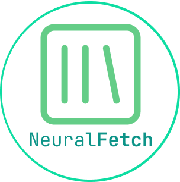
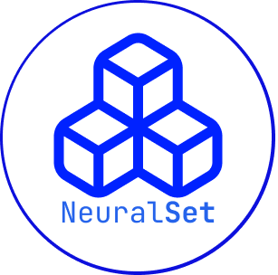
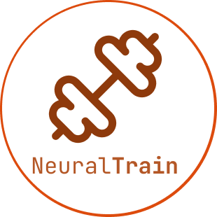

<h1 align="center">
  <span style="font-family: 'Segoe UI', 'Helvetica Neue', Arial, sans-serif; font-weight: 800; font-size: 3em; color: #4169e1; letter-spacing: -1px;">neuroai</span>
</h1>

<p align="center">
  <strong style="font-size: 1.15em; letter-spacing: 0.04em;">The Python suite for brain-AI research</strong>
</p>
<p align="center">
  <b>Simple &nbsp;·&nbsp; Fast &nbsp;·&nbsp; Robust &nbsp;·&nbsp; Scalable</b>
</p>

<p align="center">
  <a href="https://github.com/facebookresearch/neuroai/actions/workflows/ci.yml"></a>
  <a href="https://facebookresearch.github.io/neuroai/"></a>
  <a href="https://github.com/facebookresearch/neuroai/blob/main/LICENSE"></a>
  <a href="https://www.python.org/"></a>
</p>

<p align="center">
  <a href="#packages">Packages</a> &nbsp;·&nbsp;
  <a href="#related-projects">Related projects</a> &nbsp;·&nbsp;
  <a href="https://facebookresearch.github.io/neuroai/">Documentation</a>
</p>

---

neuroai is a modular Python suite for brain-AI research. It covers the full pipeline: accessing curated public brain datasets, building typed & cacheable feature pipelines across all recording modalities (MEG, EEG, fMRI, iEEG, EMG) and stimulus types (text, images, audio, video), and training deep-learning models — with a single unified interface.

<br>

<p align="center">
  <a href="https://facebookresearch.github.io/neuroai/">
    
  </a>
</p>
<p align="center">
  <sub>Interactive quickstarts &nbsp;·&nbsp; Step-by-step tutorials &nbsp;·&nbsp; Complete API reference<br>
  Pick a task, a modality, a dataset — the docs generate the code for you.</sub>
</p>

<br>

<p align="center">
  
</p>

---

## Packages

Each pipeline step maps to a dedicated package:

<table width="100%">
<tr>
<td align="center" valign="top" width="33%">
<br>
<picture>
  <source media="(prefers-color-scheme: dark)" srcset="docs/_static/neuralfetch_dark.png">
  
</picture>
<br><br>
<strong><a href="https://facebookresearch.github.io/neuroai/neuralfetch/index.html">neuralfetch</a></strong><br><br>
<sub>Access the world's curated brain datasets.<br>
19+ studies from OpenNeuro, DANDI, OSF,<br>
HuggingFace, Zenodo and more.</sub>
<br><br>

```bash
pip install neuralfetch
```

<br>
</td>
<td align="center" valign="top" width="33%">
<br>
<picture>
  <source media="(prefers-color-scheme: dark)" srcset="docs/_static/neuralset_dark.png">
  
</picture>
<br><br>
<strong><a href="https://facebookresearch.github.io/neuroai/neuralset/index.html">neuralset</a></strong><br><br>
<sub>Turn brain data into AI-ready features.<br>
Events, extractors, transforms &amp;<br>
segmentation into PyTorch datasets.</sub>
<br><br>

```bash
pip install neuralset
```

<br>
</td>
<td align="center" valign="top" width="33%">
<br>
<picture>
  <source media="(prefers-color-scheme: dark)" srcset="docs/_static/neuraltrain_dark.png">
  
</picture>
<br><br>
<strong><a href="https://facebookresearch.github.io/neuroai/neuraltrain/index.html">neuraltrain</a></strong><br><br>
<sub>Deep learning for the brain, supercharged.<br>
ConvNets, Transformers, losses, metrics<br>
&amp; multi-GPU training (PyTorch + Lightning).</sub>
<br><br>

```bash
pip install neuraltrain
```

<br>
</td>
</tr>
</table>

---

## Related projects

- **[exca](https://facebookresearch.github.io/exca/)** — Execution & caching framework powering neuroai's backbone

---

## Citation

If you use neuroai, please cite the neuralset paper (a dedicated
neuralfetch paper and a dedicated neuraltrain paper are upcoming):

```bibtex
@misc{king2026neuralset,
  title  = {NeuralSet: A High-Performing Python Package for Neuro-AI},
  author = {King, Jean-R{\'e}mi and Bel, Corentin and Evanson, Linnea
            and Gadonneix, Julien and Houhamdi, Sophia and L{\'e}vy, Jarod
            and Raugel, Josephine and Santos Revilla, Andrea
            and Zhang, Mingfang and Bonnaire, Julie and Caucheteux, Charlotte
            and D{\'e}fossez, Alexandre and Desbordes, Th{\'e}o
            and Diego-Sim{\'o}n, Pablo and Khanna, Shubh and Millet, Juliette
            and Orhan, Pierre and Panchavati, Saarang and Ratouchniak, Antoine
            and Thual, Alexis and Brooks, Teon L. and Begany, Katelyn
            and Benchetrit, Yohann and Careil, Marl{\`e}ne and Banville, Hubert
            and d'Ascoli, St{\'e}phane and Dahan, Simon and Rapin, J{\'e}r{\'e}my},
  year   = {2026},
  url    = {https://kingjr.github.io/files/neuralset.pdf},
  note   = {Preprint; URL will be updated when the paper lands on arXiv}
}
```

---

## License

This project is licensed under the [MIT License](LICENSE).

<sub>References to third-party content are subject to their own licenses.</sub>

---

<p align="center">
  <picture>
    <source media="(prefers-color-scheme: dark)" srcset="docs/_static/neuroai_anim_dark.gif">
    <source media="(prefers-color-scheme: light)" srcset="docs/_static/neuroai_anim_light.gif">
    
  </picture>
</p>
